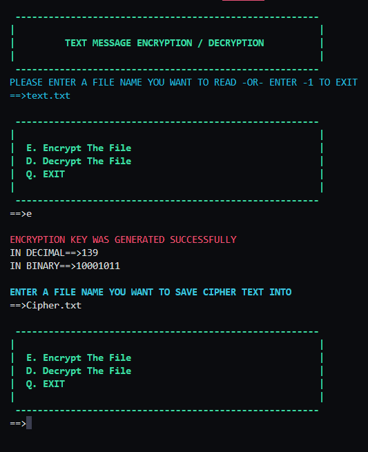

# Text-Message-Encryption-and-Decryption
Shell script that does simple encryption/decryption algorithm for text messages  with only alphabet characters. This encryption/decryption is based on the use of XOR logic gate.

## Encryption process:
The process for the encryption algorithm can be summarized in the following steps:

**Step 1** : Generate key. The key will be generated as following:
Key = Max[(sum of characters index in the word) mod 256]

The character index is the order of the character in the English alphabet. I.e. The character index of “A” or “a” 
is 1, and the character index of “W” or “w” is 23. As an example for key generation, if the file contains the 
sentence “Welcome to Linux lab” then the key will be:
Key = Max [ (23+5+12+3+15+13+5) mod 256 , (20+15) mod 256 , (12+9+14+21+24) mod 256 , (12+1+2) mod 
256 ] = 80

**Step 2**: The key will then be represented as 8-bit binary number.

**Step 3**: for each character in the text file compute the XOR between the key generated and the ASCII code of 
the character. The result will be 8-binary digit.

**Step 4**: for each 8-bit binary result, swap the first 4-bit with the last four bit. For example: 10001100 become 
11001000.

**Step 5**: at the end, swap the first 4-bit with the last four bit of the key and add it as the last character of the 
generated file.

## Decryption process:
The process for the decryption algorithm can be summarized in the following steps:

**Step 1**: get key (the las character in the encryption file) and swap the first 4-bit with the last four bit

**Step 2**: for each character in the encrypted file, swap the first 4-bit with the last for bit.

**Step 3**: Do the XOR between the key and each character from the encrypted file.

#### Tasks
- [x] Handling lower case in menu input
- [x] Handling wrong input file name
- [x] Adding Comments
- [ ] Report
- [x] Complete README
- [x] Testing with different cases 
